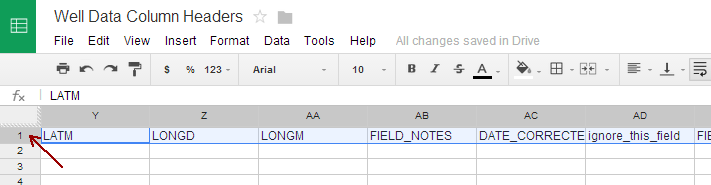
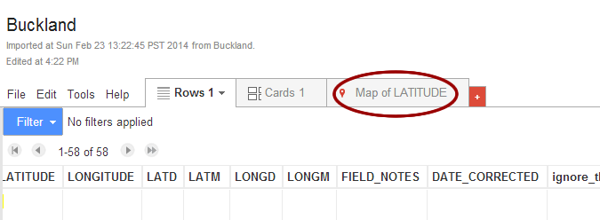

FRCOG Town Well Mapping
=======================

This document contains instructions for setting up a process to get private well data from the MA DEP, updating it via the web or via Android device, and mapping it.

You can view a map of the well locations [here](http://hackforwesternmass.github.io/frcog-private-wells/well_map).

Setting up a New Town
-------------------------

These instructions are for getting a new town online. This process is only necessary once--when DEP first sends the well data spreadsheet for a new town.

###Upload Well Data From DEP

-  Go to [http://drive.google.com](http://drive.google.com) and log in
    as frcog.cphs@gmail.com
-  Click on the folder called well data
-  Upload the town’s well data. This is the Excel file provided by DEP.


-  Click upload (the arrow button in the upper left-hand corner, next to the Create button)
-  Click Files…
-  When the File Upload dialog box appears, find the DEP Excel file on your computer and click Open
-  If you see an Upload settings box, choose Convert documents, presentations, spreadsheets, and drawings to the corresponding Google Docs format and click Start upload


- If you don’t see an Upload settings box, the document may upload as an Excel file and not a Google spreadsheet. In this case:

    -   right-click the filename after the upload is done
    -   choose Open with from menu and then click on Google sheets
    -   there’s now a copy of the document in Google spreadsheet format


-  Once the town’s data is saved as a Google spreadsheet, change all the column headers as follows. This is important because the column names must match the Memento template being used to enter data in the field.

-  Open the [Well Data Columns
   Headers](http://drive.google.com/open?id=0AuT6R06dyWnTdDkyWW1kc1A4OWZValR3WldQNTNaNHc) spreadsheet
    (also in the well data folder). This doc has the column names that
    you’ll paste into the well data spreadsheet.
-  Select the first (and only) row of data.




-  Copy the row
-  Go back to the well data Google spreadsheet and select the first
    (i.e., header) row of data. Paste the new column names over them.
- The column names now match those being used by Memento, and there
    are a few extra columns that will be used to capture additional
    information (like corrected latitude and longitude) and for
    geocoding.

-  Fill in well\_town column with the town name.


-  Fill in the first row of the Corrected\_Latitude column with the
    following formula and copy it to each cell in the column:
    `=if(NOT(AE2=""),SPLIT(AE2,":"),"")`

    Note: You might not see any data in the cells after putting in the
    formula. But you’ll be able to see the formula in the upper-left of
    the spreadsheet.


-  Fill in the first row of the well\_address column with the following
    formula and copy it to each cell in the column: `=Concatenate(C2, "
    ", D2,", ",AH2,", MA")`
-  Fill in the first row of the geocode column with the following
    formula and copy it to each cell in the column:

 `=if(NOT(AE2=""),CONCATENATE(AF2,",",AG2),IF(NOT(V2=""),CONCATENATE(V2,",",W2),AI2))`

###Create the Fusion Table

This is a one-time setup process for converting the town’s well data into a Fusion Table.

-  Return to the list of documents in the well data folder. Click the Create button in the upper right-hand corner
-  Click Fusion Table


-  When the Create in a shared folder message appears, click Create and share
-  When the Import new table dialog appears, choose Google Spreadsheets


-  When the Select a spreadsheet dialog appears, choose the spreadsheet you just uploaded. If it isn’t pictured, sort the documents by “Last Modified.”
-  Click Select


-  Wait for for the spreadsheet to load (this can take a few minutes).
    Eventually, you should see a window called Import new table. 
-  If the data preview on import looks okay, click Next


-  Click Finish 


- You should now see the new fusion table with the town’s well data.
- Tell the fusion table which column will be used for geocoding. It
    probably guessed which columns contained location data during the
    import, and it probably guessed wrong, so this is a one-time step to
    fix that.

-  Choose Edit--\>Change columns from the menu.
-  When the list of all columns appears, scroll down and click the the
    geocode column.
-  Over on the right, change the column’s Type to Location


-  Click Save
-  If there are columns other than geocode that are set to a Location
    type, change those. For example:

  -   Change OWNER\_CITY to a Type of Text
  -   Change LATITUDE to a Type of Number

-  After making sure geocode is the only Location column, click Save

##Test the Fusion Table Geocoding

Before going any further, make sure the fusion table is working and is able to create a map based on the addresses and coordinates you’ve imported.

-  If you see a Map tab above the data, click it.



-  If you don’t see a Map tab, add one by clicking  the red box with the + sign and choosing Add map


-  You’ll see a message about the data being geocoded. Depending on the number of rows, this can take a few minutes.


-  Once the geocoding is done, you should see the map again. Zoom in to
    make sure everything looks ok. Sometimes, there are obvious data
    issues, like a missing - sign on the longitude, for example:


-  Important: don’t make any data changes in the fusion tab. All
    changes should be made in the Google spreadsheet, because that’s
    what feeds the Memento database being used in the field. The next
    section has directions to update the spreadsheet and push those
    updates to the map. For now, the important thing is just to make
    sure the map works.

###Get the Fusion Table ID

Each Google fusion table has a unique id. You’ll need to copy the id of
this table to use later.

-  Click File--\>About this Table 
-  When the About This Table dialog appears, copy the Id  (referred to
    later as FUSION\_TABLE\_ID)  Paste it somewhere for later


###Add the Update Script to the Town Spreadsheet

Now that you’ve created a fusion table based on the town spreadsheet, go
back to the spreadsheet and add a script that will send future
spreadsheet updates (for example, information coming from the field) to
the fusion table.This is a one-time step.

-  Go back to the Google spreadsheet for the town
-  Open the script editor (Tools \> Script editor ...)


-  If the Google Apps Script box appears, just click Close


-  Erase the entire file (the myFunction function)


-  Add the Library to the Script

-  Choose Resources \> Libraries in the menu
-  When asked to Rename Project, pick a name for the script (the town
    name, for example)


-  Copy MMiALGiK47y1isc3wcE1li1S-o4wWKLZ2 into Find a Library
-  Click Select
-  It should put FRcog Library into the list of included libraries.


-  Choose the largest version next to FRCOG Library.


-  Click Save

-  Copy this script into the script editor

   ```
   function onOpen() {
       FRCOGLibrary.onOpen();
    };

    function updateFusion() {
         FRCOGLibrary.updateFusion('FUSION_TABLE_ID');
    }
   ```

-  Replace FUSION_TABLE_ID with the real one from the Get Fusion Table ID instructions (above).

-  For Example:

 `FRCOGLibrary.updateFusion('MMiALGiK47y1isc3wcE1li1S-o4wWKLZ2');`

-  Save and close the script editor
-  Reload the spreadsheet, you should have a menu called “Data Update
    Functions”

-  Can take as long as a minute the first time


- Choose Data Update Functions > Update Fusion Data
- You will have to authorize the script the first time it runs.

- Click OK to authorize the script


- Click Accept to allow the script to make updates to the Google
    drive, etc.


- Choose Data Update Functions \> Update Fusion Data again

- You should see a message that the fusion table has been updated
    successfully

- If not, email us with the error message that shows (see contact info
    below)

- After the update completes, go back to the Fusion table and
    re-geocode everything:

- File--\>Geocode…

###2. Updating Data

There are two ways to update a town’s well data:

-  In the town’s Google spreadsheet
-  Via the Memento Android app

###Updating the Google Spreadsheet

Assuming the initial setup of the town’s Google spreadsheet was done correctly (see above):

-  Make changes to the spreadsheet (don’t change the columns that have formulas).
-  Choose  Data Update Functions > Update Fusion Data from the menu.
-  When the updates are done, open the town’s corresponding fusion table and select File-->Geocode... to update the map points.

###Updating via Android device

See [these instructions for using
Memento](https://docs.google.com/document/d/1hCPCUvjqWWbUcVXPusCPaGmMWVI0KZNiJhBvqWUsNQI).

###Miscellaneous Notes

One-Time Setup

-   Get API key
-   Create script (customized for API key, etc.) and publish it as a
    library

Options for taking multiple fusion tables (one for each town) into a
single map:

Option 1: use layers to create a new map

[https://support.google.com/fusiontables/answer/2592769?hl=en&ref\_topic=2592807](https://support.google.com/fusiontables/answer/2592769?hl=en&ref_topic=2592807)

sample code:

[http://gmaps-samples.googlecode.com/svn/trunk/fusiontables/multiple\_layers\_per\_map.html](http://gmaps-samples.googlecode.com/svn/trunk/fusiontables/multiple_layers_per_map.html)

wizard:

[http://fusion-tables-api-samples.googlecode.com/svn/trunk/FusionTablesLayerWizard/src/index.html](http://fusion-tables-api-samples.googlecode.com/svn/trunk/FusionTablesLayerWizard/src/index.html)

Option 2: merge tables into one table, then map

[https://support.google.com/fusiontables/answer/171254?hl=en&ref\_topic=2572284](https://support.google.com/fusiontables/answer/171254?hl=en&ref_topic=2572284)

Note that there is a limit of 8 tables to merge onto a single map.

Other resources:

[http://michelleminkoff.com/2011/08/21/how-to-combine-multiple-fusion-tables-into-one-map/](http://michelleminkoff.com/2011/08/21/how-to-combine-multiple-fusion-tables-into-one-map/)

Developer Notes
===============

How the Data Update Function menu works

There is a code library in the “FRCOG Library” spreadsheet in “MA Wells”.  Open it, then open the script editor.

There are instructions at the top of the file to save a version and update library version usage which you must follow.

The Google spreadsheet columns names must match the column names in the Memento template. These column names are stored in the Well Data Column Headers spreadsheet (for easy copy & paste) and are also below:

WELL\_COMPLETION\_ID
WELL\_LOCATION
WELL\_STREET\_NUMBER
WELL\_STREET\_NAME
PROPERTY\_OWNER
WELL\_SUB\_NAME
OWNER\_ADDRESS
OWNER\_STREET\_NUMBER
OWNER\_STREET\_NAME
OWNER\_CITY
ASSESSORS\_LOT
ASSESSORS\_MAP
BOH\_DATE\_ISSUED
DEPTH\_TO\_BEDROCK
BOH\_PERMIT
WC\_DATE
COMMENTS
FIRM
WELL\_TYPE
SUPERVISING\_DRILLER
WC\_DEPTH
LATITUDE
LONGITUDE
LATD
LATM
LONGD
LONGM
FIELD\_NOTES
DATE\_CORRECTED
ignore\_this\_field
FIELD\_LOCATION
Corrected\_Latitude
Corrected\_Longitude
well\_town
well\_address
geocode

Current Limitations/Known Issues/TODOs
======================================

-   We hit a few rate limits with the Google API. Current script code batches fusion table updates into 3 batches of 200
-   Intermittent errors when running the update script several times in a row. Related to above rate limit issue? Wait a few minutes and try again.
-   Would be great to move the spreadsheet functions into the fusion table update script

