#Memento Database Installation for Android Devices

The following instructions will allow you to install the Memento
Database and Private Well Databases onto your Android device.

There are two different actions you need to take. The first is to
install the Memento Database App, which will be the app used to view and
edit Well data. The second action is to set up the App on your device to
give it access to the various towns.

##Installation of Memento Database App

This step must be performed once for the device.

Click on the following link and install the Application to your device:
[https://play.google.com/store/apps/details?id=com.luckydroid.droidbase&hl=en](https://play.google.com/store/apps/details?id=com.luckydroid.droidbase&hl=en)

Alternatively, on your device’s main screen, touch the “Play Store” app
icon. Touch the Magnifying Glass in the top of the screen, and in the
text box type “Memento Database” to find the “Memento Database” app by
“Lucky Droid”.

* * * * *

##Creating Private Well Library

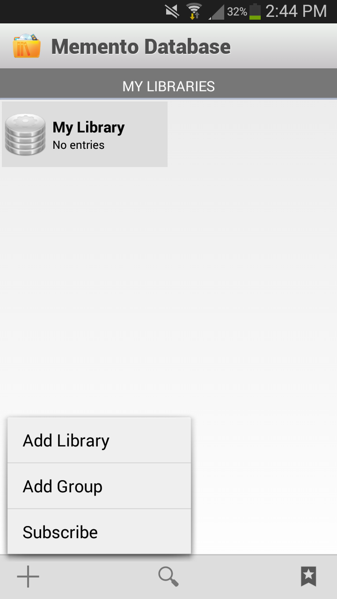

These steps must be performed for each town whose data you wish to view
or edit on your device.

1.) Touch the Memento Database app icon on your main screen to open the
App. Touch the “+” sign on the bottom, and touch “Add Library”.

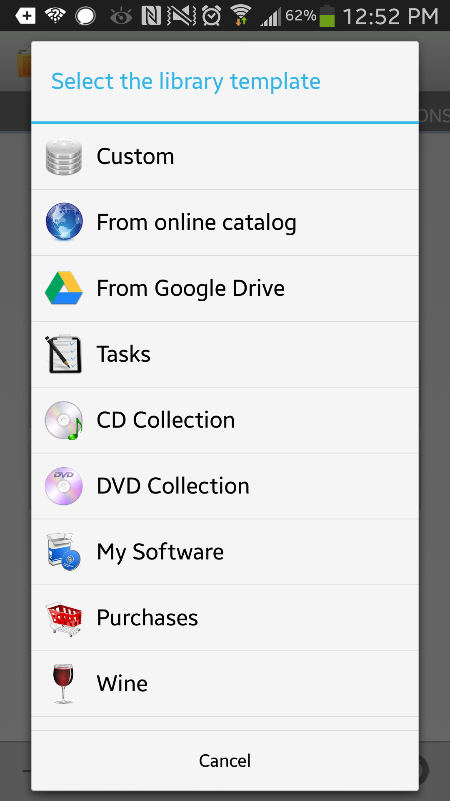

2.) Touch “From online catalog”

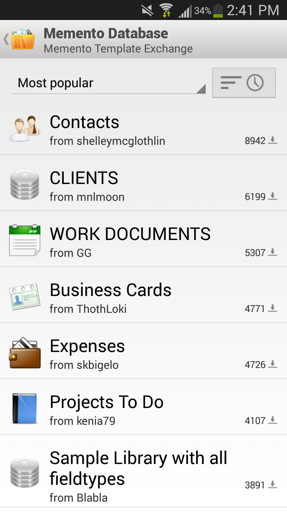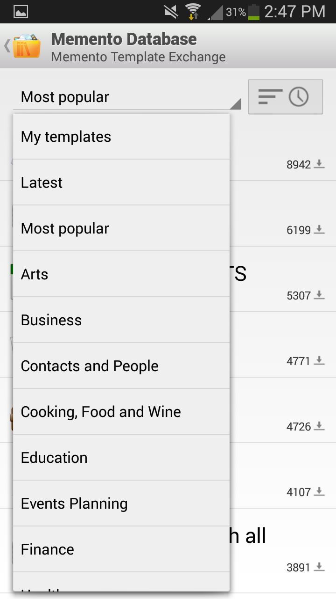

3.) Touch “Most popular”, then scroll up and touch “My Templates”.

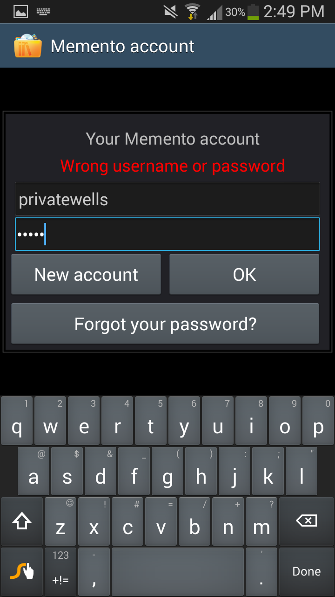

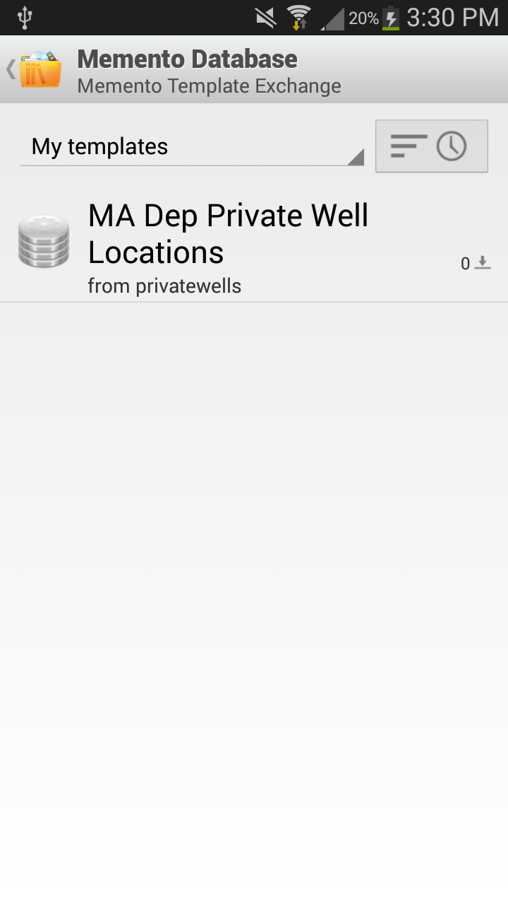

5.) Touch “MA DEP Private Well Location”.

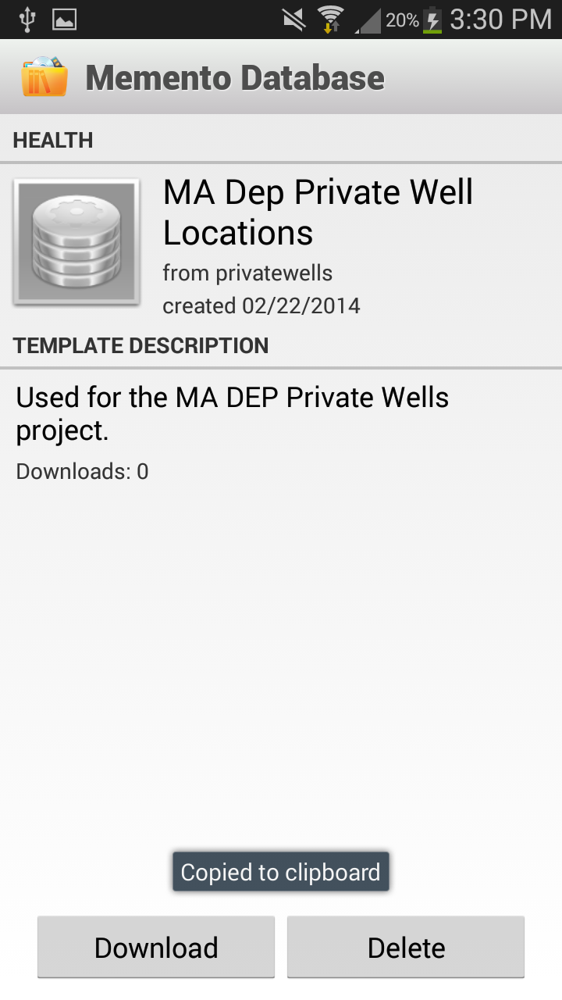

6.) Touch “Download”.

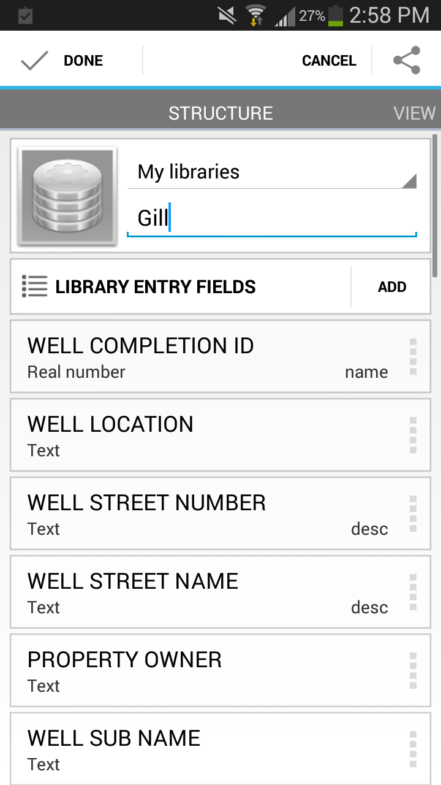

7.) Rename “MA DEP Private Well Location Corrector” to the name of the
town.

8.) Touch “Done”.

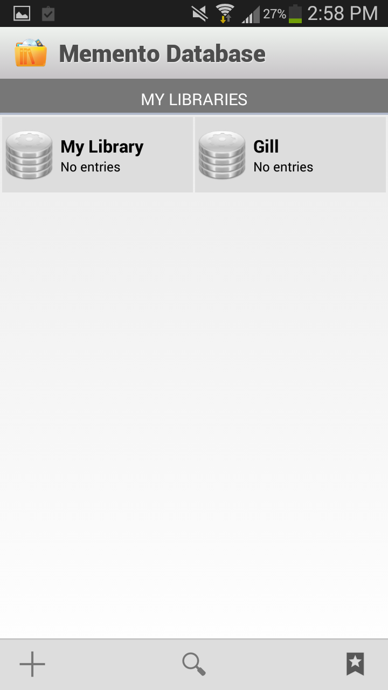

9.) Touch and hold your finger on the new town to bring up the menu for
that town.

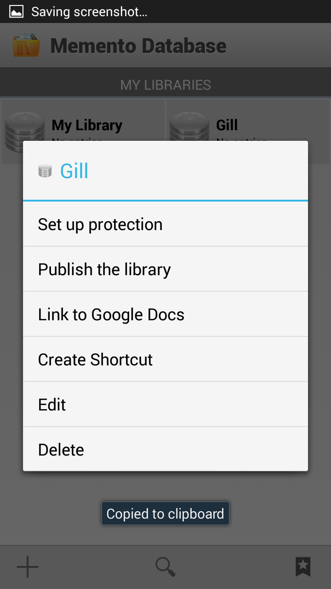

10.) Touch “Link to Google Docs”

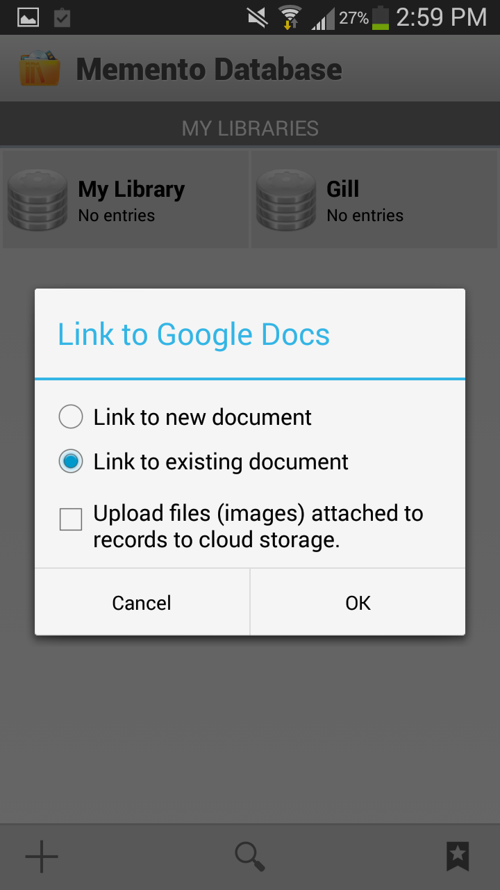

11.) Touch “Link to existing document”.

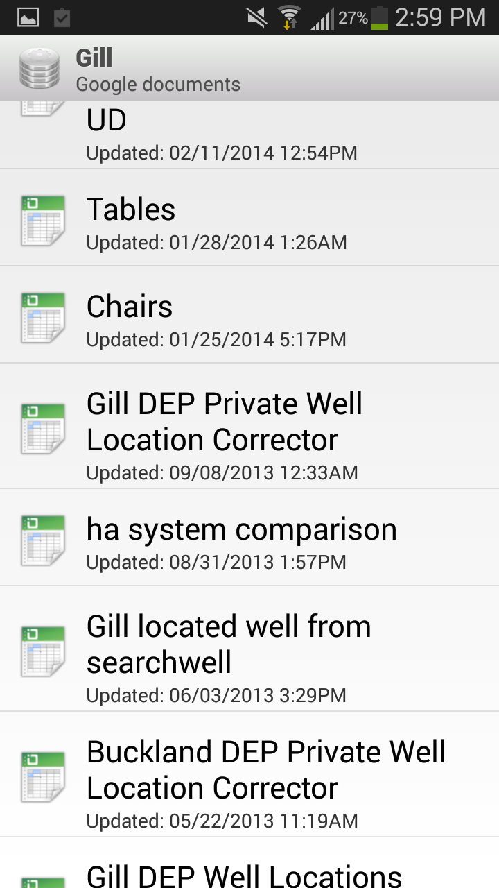

12.) Touch the name of the document named “\_\_\_\_\_ DEP Private Well
Location Corrector”, where the blank is the name of the town.

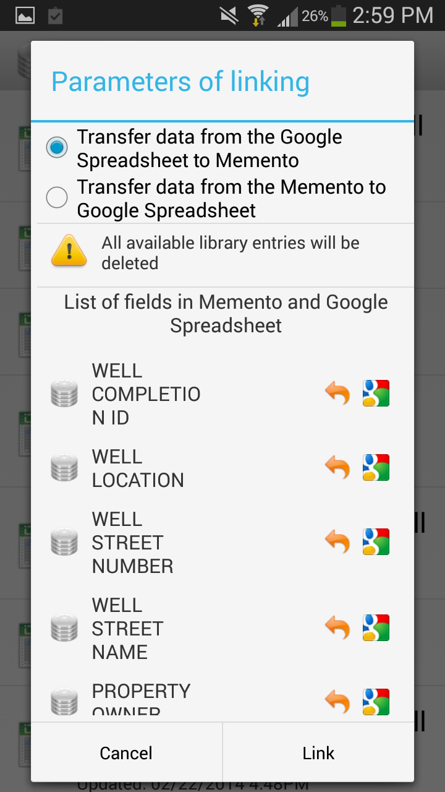

13.) Ensure that “Transfer data from the Google Spreadsheet to Memento”
is selected. Then touch “Link”.

14.) Have a sandwich while the synchronization finishes. When complete,
the data should be synchronized.

* * * * *

